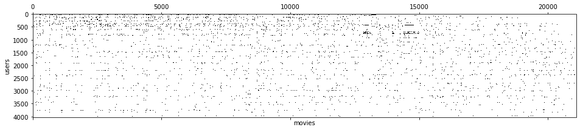

# Netflix Movie Recommendation

    
    
Movie reviews sparse matrix: which users rated which movies

## About this project: Recommending movies based on reviews
This is an End-to-End Machine Learning project. It begins with collecting user movie reviews from the web and ends in an interective web application that recommends movies. The project is divided as follows:

- Problem definition
- Data Collection and cleaning
- Exploratory analysis
- Modelling
- Deployment

## Tools used
(TODO)

## Overview of each part of the project
### 1. Problem definition
I hear a lot about people spending a lot of time choosing a movie, sometimes even more time than they spend actually watching movies. Machine Learning can help solve this problem by giving convencing recommendations!
- **Problem**: Lower time searching by netflix movies
- **ML to solve this problem**: Utilize user reviews from movie social medias in conjunction with a collaborative filtering algorithm (recommender system)
- **How to use the solution in production**: Create a web that allows users tell 5 movies they liked and optianally some movies they didn't like, and based on these informations present movies the user might like, ordered by probability
- **Validation Metrics**: 
  - **Primary**: How many of the recommended movies are maked as interesting (user signals that he wants to watch it)
  - **Secondaries**: Time spent searching for a movie; How many recommended movies were actually watched.
  
### 2. Data Collection and cleaning
Data was webscraped from a movie review website. First, the website search page were scraped in order to find the link to each netflix movie page. Than, for each netflix movie found, all users rating were scraped to form a matrix with m (number of movies) rows and u (number of users) columns.

### 3. Exploratory analysis
(TODO)

### 4. Modelling
(TODO)
(Singular Value Decomposition)

### 5. Deployment
(TODO)
  
  
## About me
**Made with ❤️ by Ian Fukushima | [LinkedIn](https://linkedin.com/in/ian-fukushima) | [GitHub](https://github.com/isfuku) | [Kaggle](https://www.kaggle.com/ianfukushima)**
